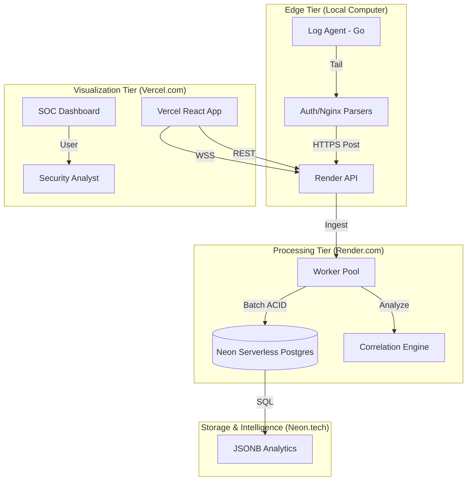

# NetInsight: Cloud-Native Distributed SIEM & Real-Time Security Observability

NetInsight is a production-grade, distributed Security Information and Event Management (SIEM) platform. It is engineered for massive scale, utilizing a decoupled architecture to ingest, correlate, and visualize millions of security events in real-time.

---

## 🏗️ 1. Cloud-Native Architecture

NetInsight is deployed as a globally accessible SaaS platform, utilizing best-in-class cloud infrastructure for maximum availability and performance.

### Technical Flow Diagram


---

## 🌐 2. Live Infrastructure

*   **SOC Dashboard (Vercel)**: [https://multi-tenant-siem.vercel.app](https://multi-tenant-siem.vercel.app)
*   **Ingestion API (Render)**: [https://sentinelx-api-nmop.onrender.com](https://sentinelx-api-nmop.onrender.com)
*   **Database (Neon)**: Serverless PostgreSQL Cluster
*   **Health Status**: `https://sentinelx-api-nmop.onrender.com/healthz`

---

## 🛡️ 3. Production Security Features

### 🔍 Correlation & Detection Engine
*   **SSH Brute Force**: Detects 5+ failed login attempts from a single IP within a 60-second sliding window.
*   **Web Vulnerability Scanning**: Monitors reconnaissance of sensitive paths (e.g., `/admin`, `/.env`, `/wp-admin`).
*   **Dynamic Risk Scoring**: Attackers are assigned a Risk Score (0-100) using the formula: `min(attack_count * 10, 100)`.

### 🚫 Advanced Alert Management
*   **Alert Suppressor**: Implements a 5-minute cooldown window per `Type:IP` pair to prevent notification fatigue while maintaining a background audit trail.
*   **Master API Key Auth**: Production-ready authentication using environment-injected secrets (`MASTER_API_KEY`).

---

## ⚡ 4. Performance & Reliability

### Ingestion Optimizations
*   **ACID Batching**: Ingestion service buffers logs into batches of 500 or 2 seconds, reducing database transaction overhead by **99.5%**.
*   **WebSocket Aggregation**: Real-time alerts are bundled and broadcast once per second, preventing frontend re-render thrashing.
*   **Zero-IO Path**: The edge `log-agent` operates without blocking Terminal I/O, ensuring high-velocity log tailing.

### Hybrid Scalability
*   **Cloud Backend**: Handles global ingestion and correlation.
*   **Local Agent**: Lightweight Go binary that can be deployed on any server to tail local logs and stream them to the NetInsight cloud.

---

## 📊 5. Observability & Telemetry

The system is fully instrumented with **Prometheus** metrics:
*   `kafka_messages_consumed_total`: Ingestion throughput.
*   `events_processed_total`: Successful processing count.
*   `worker_queue_depth`: Backpressure monitoring.
*   `alerts_generated_total`: Threat signal segmentation.
*   `websocket_connections_active`: Real-time user tracking.

---

## 🚀 6. Getting Started (Hybrid Mode)

To stream logs from your local server to the NetInsight cloud:

### 1. Configure the Agent
Update `log-agent/sender/sender.go`:
```go
const SIEMEndpoint = "https://sentinelx-api-nmop.onrender.com/logs"
const APIKey = "YOUR_MASTER_API_KEY"
```

### 2. Run the Agent
```powershell
cd log-agent
go run .
```

### 3. Stress Test the Pipeline
```powershell
cd log-agent/test-logs
go run stress_tester.go
```

---

## 📝 7. Environment Variables

### Ingestion Service (Render)
*   `DATABASE_URL`: Connection string for Neon Postgres.
*   `PORT`: Dynamic port assignment (handled by Render).
*   `MASTER_API_KEY`: Production secret for log ingestion.
*   `JWT_SECRET`: Secret key for session management.

### SOC Dashboard (Vercel)
*   `VITE_API_URL`: `https://sentinelx-api-nmop.onrender.com`
*   `VITE_WS_URL`: `wss://sentinelx-api-nmop.onrender.com`

---
© 2026 NetInsight Project. Cloud-Native Security Operations.
