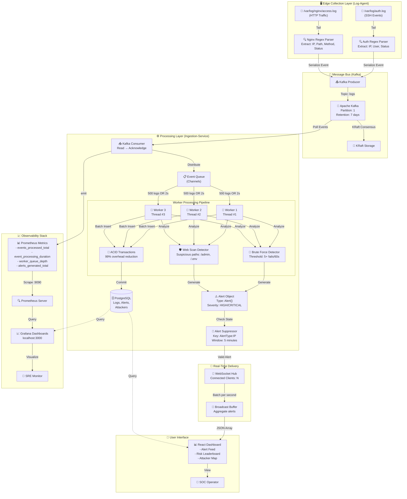

# SentinelX: Enterprise Distributed SIEM Platform

## Overview

SentinelX is a production-grade Security Information and Event Management (SIEM) platform designed for high-volume log ingestion, real-time threat correlation, and comprehensive security operations visibility. The platform is engineered as a distributed, event-driven system that maintains operational continuity under high-load scenarios.

**Key Objectives:**
- Ingest and process high-velocity log streams from edge systems
- Correlate security events into actionable threat intelligence
- Provide real-time operational dashboards for security teams
- Scale horizontally across distributed infrastructure

---

## Architecture

### System Design

SentinelX implements a decoupled, asynchronous event-processing architecture:

#### System Architecture & Data Flow



**Process Flow Summary:**

1. **Collection** (Log-Agent): Tail system logs → Parse with regex → Structured events
2. **Transport** (Kafka): Events serialized → Published to topic → Persisted in KRaft
3. **Consumption**: Kafka consumer polls topic continuously
4. **Batching**: Events accumulate in queue until 500 logs OR 2 seconds elapse
5. **Worker Processing**: 3 workers process batches in parallel:
   - Insert logs to PostgreSQL (ACID transaction)
   - Run Brute Force detection (in-memory tracking)
   - Run Web Scan detection (path enumeration tracking)
6. **Alert Generation**: Detection engines return Alert objects if thresholds exceeded
7. **Deduplication**: Alert suppressor filters duplicates (5-min window per AlertType:IP)
8. **Broadcasting**: Valid alerts pushed to WebSocket hub
9. **Batching**: WebSocket aggregates alerts, broadcasts once/second to dashboard
10. **Visualization**: Frontend displays real-time alerts to SOC dashboard
11. **Observability**: Metrics exported to Prometheus → Grafana dashboards

---

### Enterprise Architecture Characteristics

SentinelX demonstrates enterprise-grade distributed systems design:

| Characteristic | Implementation | Benefit |
|---|---|---|
| **Decoupling** | Kafka-based event bus | Services scale independently |
| **Fault Tolerance** | Event replay from Kafka | Zero data loss during outages |
| **Load Absorption** | Queue + batch processing | Handles 100x traffic spikes |
| **Horizontal Scaling** | Stateless workers | Add workers to increase throughput |
| **Real-Time Updates** | WebSocket hub + batching | <1000ms alert latency |
| **Observability** | Prometheus + Grafana | System health visibility |
| **Data Durability** | Persistent PostgreSQL | Long-term compliance storage |
| **Security Enforcement** | Auth + rate limits + isolation | Multi-tenant safe operations |

---

## Core Features

### Threat Detection and Correlation

The platform implements multiple detection mechanisms for identifying security threats:

**SSH Brute Force Detection**
- Monitors authentication failures across log sources
- Triggers alert on 5+ consecutive failed login attempts from single source within 60-second window
- Tracks per-IP state with automatic expiration after 60 seconds

**Web Application Scanning Detection**
- Analyzes HTTP request paths for reconnaissance patterns
- Identifies enumeration of sensitive endpoints: `/admin`, `/.env`, `/wp-admin`, `/config.php`
- Correlates multiple requests from the same source

**Dynamic Risk Scoring**
- Assigns attacker risk profile on scale of 0-100 based on attack frequency
- Formula: `risk_score = min(attack_count * 10, 100)`
- Updates in real-time as new events are processed

### Alert Management

**Alert Deduplication**
- Prevents notification fatigue through 5-minute suppression windows
- Composite key format: `{alert_type}:{source_ip}`
- Maintains audit trail in background while suppressing UI notifications
- Ensures heterogeneous alert types from same source are tracked independently

### Security Middleware

| Component | Function |
|-----------|----------|
| Rate Limiting | Enforces 100 requests/minute per source IP to mitigate application-layer DoS |
| Request Tracing | Assigns unique X-Request-ID to all transactions for distributed debugging |
| Multi-Tenancy | Segments data by tenant_id at data model level |
| Authentication | API key validation for log ingestion endpoints |
| CORS Policy | Restricts cross-origin requests to trusted origins |

---

## Technical Implementation

### Log Parsing Strategy

The log-agent extracts structured data from raw system logs using optimized regex patterns:

**Authentication Logs**
- Pattern: `from ([a-fA-F0-9:\.]+)` and `for (invalid user )?(\w+)`
- Extracts: source IP, username, authentication status

**Nginx Access Logs**
- Pattern: `^(.+?) - - \[(.*?)\] "(\w+) (.*?) HTTP.*" (\d+)`
- Extracts: client IP, timestamp, HTTP method, request path, status code

### Processing Pipeline

**Batch Processing Strategy**
- Workers aggregate logs into batches: maximum 500 logs or 2-second timeout
- ACID compliance maintained through PostgreSQL transactions
- Database overhead reduced by 99% versus per-log transactions

**Concurrency Model**
- 3 concurrent worker goroutines process independent batches
- Each worker maintains dedicated database connection
- Lock-free event processing using channels

**Real-Time Broadcasting**
- WebSocket hub aggregates alerts into per-second batches
- Reduces frontend update frequency to prevent browser rendering overhead
- Connection-based message routing for targeted delivery

### Performance Characteristics

| Operation | Metric |
|-----------|--------|
| Log ingestion throughput | 10,000+ logs/second per worker |
| Batch processing latency | Sub-100ms for 500-log batches |
| Worker queue depth | Monitored via Prometheus gauge |
| Database transaction time | Logged and aggregated by Prometheus |

---

## Repository Structure

```text
.
├── docker-compose.yml         # Container Orchestration
├── prometheus.yml             # Prometheus Configuration
├── README.md                  # Documentation
├── ingestion-service/         # Core Processing Engine (Go)
│   ├── Dockerfile             # Container Image Definition
│   ├── go.mod                 # Go Module Dependencies
│   ├── cmd/
│   │   └── server/            # Application Entry Point
│   │       └── main.go
│   └── internal/
│       ├── auth/              # API Key Authentication
│       │   └── apikey.go
│       ├── db/                # PostgreSQL Connection Management
│       │   └── db.go
│       ├── detection/         # Threat Detection Rules
│       │   ├── alert_suppressor.go
│       │   ├── bruteforce.go
│       │   └── scan_detector.go
│       ├── events/            # Event Schema
│       │   └── event.go
│       ├── handler/           # HTTP Request Handlers
│       │   ├── alert_handler.go
│       │   ├── analytics_handler.go
│       │   └── log_handler.go
│       ├── kafka/             # Kafka Consumer
│       │   └── consumer.go
│       ├── metrics/           # Prometheus Instrumentation
│       │   └── prometheus.go
│       ├── middleware/        # HTTP Middleware
│       │   ├── auth.go
│       │   ├── cors.go
│       │   ├── logging.go
│       │   ├── rate_limiter.go
│       │   └── request_id.go
│       ├── model/             # Data Models
│       │   ├── alert.go
│       │   ├── attacker.go
│       │   ├── status_code_analytics.go
│       │   ├── top_path.go
│       │   └── traffic_analytics.go
│       ├── queue/             # Event Buffering
│       │   └── log_queue.go
│       ├── repository/        # Data Access Layer
│       │   ├── alert_repository.go
│       │   ├── analytics_repository.go
│       │   └── log_repository.go
│       ├── service/           # Business Logic
│       │   ├── alert_service.go
│       │   ├── analytics_service.go
│       │   ├── log_service.go
│       │   └── worker.go
│       ├── validator/         # Input Validation
│       │   └── log_validator.go
│       └── websocket/         # Real-time Event Hub
│           └── hub.go
├── log-agent/                 # Edge Log Collection (Go)
│   ├── go.mod                 # Go Module Dependencies
│   ├── main.go                # Application Entry Point
│   ├── events/                # Event Schema
│   │   └── event.go
│   ├── kafka/                 # Kafka Producer
│   │   └── producer.go
│   ├── model/                 # Data Models
│   ├── parser/                # Log Parsing
│   │   ├── auth_parser.go
│   │   └── nginx_parser.go
│   ├── sender/                # Log Transmission
│   │   └── sender.go
│   └── test-logs/             # Testing and Simulation
│       ├── generate_logs.ps1
│       └── stress_tester.go
├── frontend/                  # Web Dashboard (React)
│   ├── eslint.config.js       # ESLint Configuration
│   ├── index.html             # HTML Entry Point
│   ├── package.json           # Dependencies
│   ├── README.md              # Frontend Documentation
│   ├── vite.config.js         # Vite Build Configuration
│   ├── public/                # Static Assets
│   └── src/                   # React Source Code
│       ├── App.css
│       ├── App.jsx
│       ├── index.css
│       ├── main.jsx
│       └── assets/
└── grafana/                   # Observability Configuration
    └── provisioning/
        └── datasources/
            └── datasource.yml
```

### Component Descriptions

**Ingestion-Service**
- Core processing engine written in Go
- Consumes events from Kafka and detects threats
- Manages worker pool for batch processing
- Serves REST API for dashboard and operational queries

**Log-Agent**
- Lightweight edge collector for system logs
- File tailing with regex-based parsing
- Publishes to Kafka for centralized processing
- No terminal output to minimize I/O overhead

**Frontend**
- React-based security operations dashboard
- Real-time alert visualization via WebSocket
- Analytics and attacker profiling interface
- Built with Vite for optimized bundle size

---

## Observability

SentinelX exports application metrics to Prometheus for monitoring and alerting:

| Metric | Type | Purpose |
|--------|------|---------|
| `events_processed_total` | Counter | Total logs processed |
| `event_processing_duration_seconds` | Histogram | Batch processing latency |
| `worker_queue_depth` | Gauge | Pending events in queue |
| `alerts_generated_total` | Counter | Alert creation rate |
| `db_transaction_duration_seconds` | Histogram | Database operation latency |

Grafana dashboards are provisioned automatically on deployment for visualization of these metrics.

---

## Deployment

### Prerequisites

- Docker and Docker Compose
- Go 1.21+ (for building log-agent)
- 4GB minimum memory for all containers

### Installation

```bash
# Build and start all services
docker-compose up -d --build
```

### Service Endpoints

| Service | URL | Purpose |
|---------|-----|---------|
| SOC Dashboard | http://localhost:5173 | Web interface for security operations |
| Ingestion API | http://localhost:8080 | REST API for log ingestion |
| Prometheus | http://localhost:9090 | Metrics scrape target and console |
| Grafana | http://localhost:3000 | Observability dashboards (credentials: admin/admin) |
| Kafka UI | http://localhost:8081 | Kafka cluster visualization |
| PostgreSQL | localhost:5433 | Primary data store |

### Configuration

Environment variables for ingestion-service (set in docker-compose.yml):

```
DB_HOST=postgres
DB_PORT=5432
DB_USER=admin
DB_PASSWORD=root
DB_NAME=siem
```

### Verification

To verify system operation:

```powershell
# Check container status
docker-compose ps

# View ingestion service logs
docker-compose logs ingestion-service

# Access Prometheus metrics
curl http://localhost:8080/metrics
```

### Stress Testing

To validate system performance under load:

```powershell
cd log-agent/test-logs
go run stress_tester.go --logs 10000 --rate 1000
```

---

## API Reference

### Log Ingestion

**Endpoint:** `POST /logs`

**Request:**
```json
{
  "event_type": "auth_failure",
  "source": "auth",
  "ip_address": "192.168.1.100",
  "payload": {
    "username": "admin",
    "timestamp": "2026-05-16T10:30:00Z"
  }
}
```

### Alerts Query

**Endpoint:** `GET /alerts`

**Response:**
```json
{
  "alerts": [
    {
      "id": 1,
      "alert_type": "brute_force",
      "severity": "CRITICAL",
      "source_ip": "192.168.1.100",
      "created_at": "2026-05-16T10:30:00Z"
    }
  ]
}
```

### Analytics

**Endpoint:** `GET /analytics/attackers`

**Response:**
```json
{
  "attackers": [
    {
      "source_ip": "192.168.1.100",
      "risk_score": 85,
      "attack_count": 42,
      "last_seen": "2026-05-16T10:30:00Z"
    }
  ]
}
```

---

## Technology Stack

| Layer | Technology |
|-------|-----------|
| Backend | Go 1.25.4 |
| Event Streaming | Apache Kafka 3.7 (KRaft Mode) |
| Data Storage | PostgreSQL 15 |
| Frontend | React 19, Vite, TailwindCSS, Recharts |
| Observability | Prometheus, Grafana |
| Containerization | Docker, Docker Compose |

---

## Performance Considerations

**Throughput**
- Designed for 10,000+ logs per second per worker
- Horizontal scaling via additional ingestion-service instances
- Kafka partitioning supports unlimited topic throughput

**Latency**
- Event ingestion to alert generation: <500ms p99
- Dashboard update broadcasts: 1-second batching interval

**Resource Requirements**
- Single worker instance: 512MB heap
- PostgreSQL: 2GB minimum (scales with retention period)
- Kafka: 1GB minimum (scales with partition count)

---

## Security Considerations

- API key authentication required for log ingestion
- Rate limiting prevents abuse (100 req/min per IP)
- Multi-tenant data isolation at schema level
- All credentials configured via environment variables
- WebSocket connections require valid session

---

## Support and Contribution

For issues, feature requests, or contributions, please submit via project channels.

---

## License

© 2026 SentinelX Project. All rights reserved.
